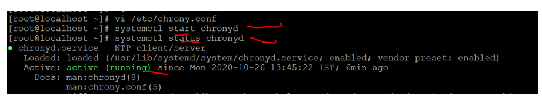
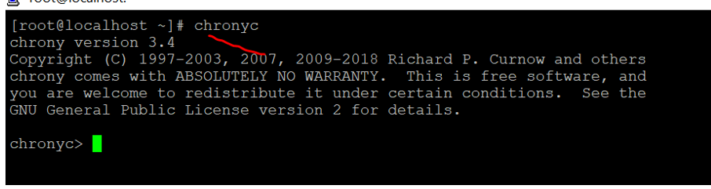
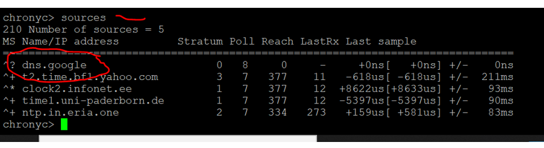

 # Chrony
 * <b>Purpose </b> – <u> Time Synchronization </u> 
 * Package name – chronyd 
 * Config file - /etc /chrony.conf 
 * Log file -/var/log/chrony
 * Service – systemctl start /restart chronyd
 * Program  command – chronyc
### Step 1 -> Install the package : 
      *yum install -y chrony

### Step 2 -> Edit /etc/chrony.conf file  
      * vi /etc/chrony.conf
      * add server 8.8.8.8( google server address to get time synced in our server ) where all the server listed in file
     
 
 
### Step 3 – start the chronyd service  
      * systemctl start chronyd 
      
### Step 4– check the status of chronyd service  
      * systemctl status chronyd
      * it should be in active state
      
 
 
 
 ### Step 5– check our configuration is working or not   
      * type chronyc 
      * We will get chronyc command prompt 
      
 
 
 ### Step 6 On chronyc command prompt 
      * Type Sources
      *you will see the resposne from google server
      
 
 
### Step 7 - if we see the reponse from step 6 our step is working fine
      *  The End!!

 
 

 
 
